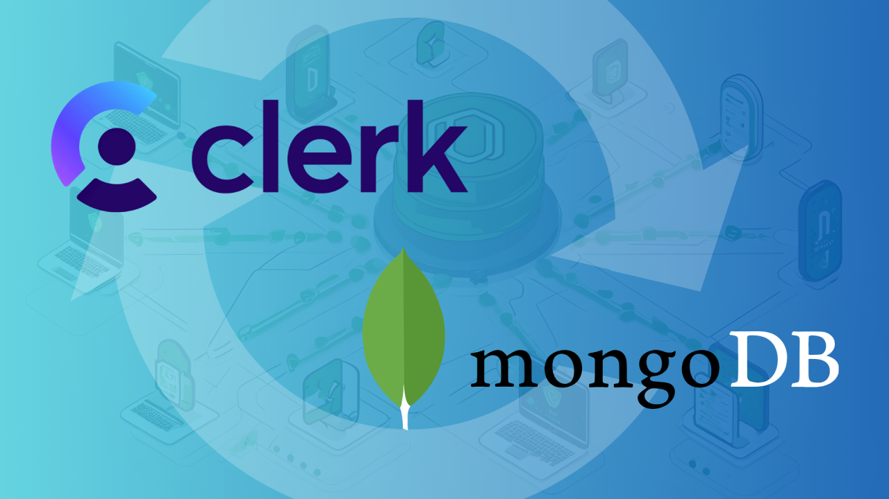

# Clerk_nextjs_mongodb

This project is a [Next.js](https://nextjs.org/) application that integrates Clerk for authentication and MongoDB for data storage. It provides a modern, full-stack web development setup with powerful features and scalability.

## Overview
clerk_nextjs_mongodb combines the following technologies:

[Next.js](https://nextjs.org/): A React framework for building server-side rendered and statically generated web applications
[Clerk](https://clerk.com/): A complete authentication and user management solution
[MongoDB](https://www.mongodb.com/): A popular NoSQL database for flexible and scalable data storage
## Getting Started
To run this project locally, follow these steps:

1. Clone the repository:
```
git clone https://github.com/musikito/clerk_nextjs_mongodb
cd clerk_nextjs_mongodb
```


2. Install dependencies:
```
npm install
```


3. Set up environment variables (for Clerk and MongoDB connections)

4. Run the development server:
```
npm run dev
```


5. Open http://localhost:3000 in your browser to see the application.

## Features
- User authentication with Clerk
- Server-side rendering with Next.js
- MongoDB integration for data persistence
- Responsive design

## Project Structure
- ``` app/```: Contains the main application code
- ```components/```: Reusable React components
- ```api/```: Differents SSR apis(Webhooks, data, etc...)
- ```models/```: MongoDB schema definitions
- ``` public/```: Static assets
- ```actions```: Actions to interact with the webhooks and the app
## Configuration
Ensure you have set up the necessary environment variables for Clerk and MongoDB connections. Create a ```.env``` file in the root directory with the following variables:

NEXT_PUBLIC_CLERK_PUBLISHABLE_KEY=your_clerk_publishable_key
CLERK_SECRET_KEY=your_clerk_secret_key
MONGODB_URI=your_mongodb_connection_string


## Deployment
The easiest way to deploy your Next.js app is to use the [Vercel Platform](https://vercel.com/new?utm_medium=default-template&filter=next.js&utm_source=create-next-app&utm_campaign=create-next-app-readme) from the creators of Next.js.

Check out our [Next.js deployment documentation](https://nextjs.org/docs/deployment) for more details.

1. Push your code to a GitHub repository
2. Connect your repository to Vercel
3. Configure environment variables in Vercel dashboard
4. Deploy
### Learn More
[Next.js deployment documentation](https://nextjs.org/docs/deployment)
[Clerk Documentation](https://clerk.com/docs)
[MongoDB Documentation](https://www.mongodb.com/docs/)
## Video Tutorial
Wacth this video [tutorial](https://www.youtube.com/watch?v=pjFbcXi8eCM)

Contributing
Contributions are welcome! Please feel free to submit a Pull Request.

License
MIT License